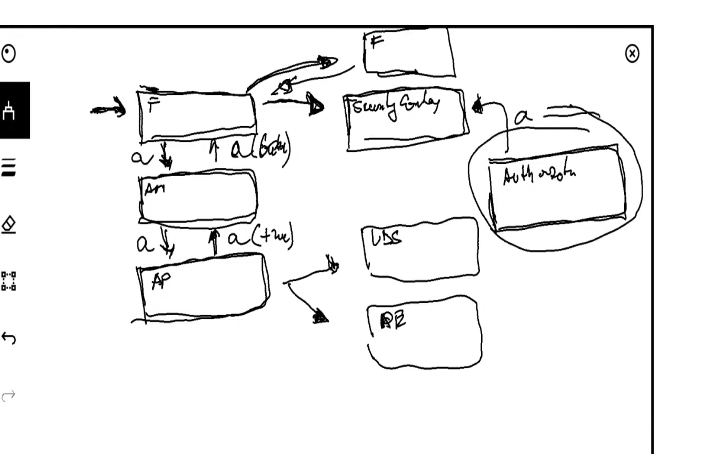

**Project**

```agsl
Spring security Project with my custom authentication so as to understand the filter chain.

Authentication mechanism where the request, must have the word secret in the header other-wise the 
request will not be authorized,
```

**Task**


**Authenitication Flow Spring Security**




```agsl

We shall interact with the 
 
  (a)Authentication Filter
  
  (b)Authenitication Manager
  
  (c)Authentication Provider 
  
In the process.

My understanding

Authentication Object

It is very key, it is taken in as a class propery by both the manager and the provider.

The manager sets the initial state to false.

Reaches out to the provider to check validity, when true it sets is athenticated as true.

i can then set my context.


```

**N/B**

```agsl

Rest controller advice cannot catch exceptions outside its aspect, for instance it cannot be able to catch exceptions
thrown in the filter chain,
```

**Conclusion**

```agsl
The next filter we look at after the authentication filter is the authorization filter.

It takes from the security context, the authorization and applies the rules.

```